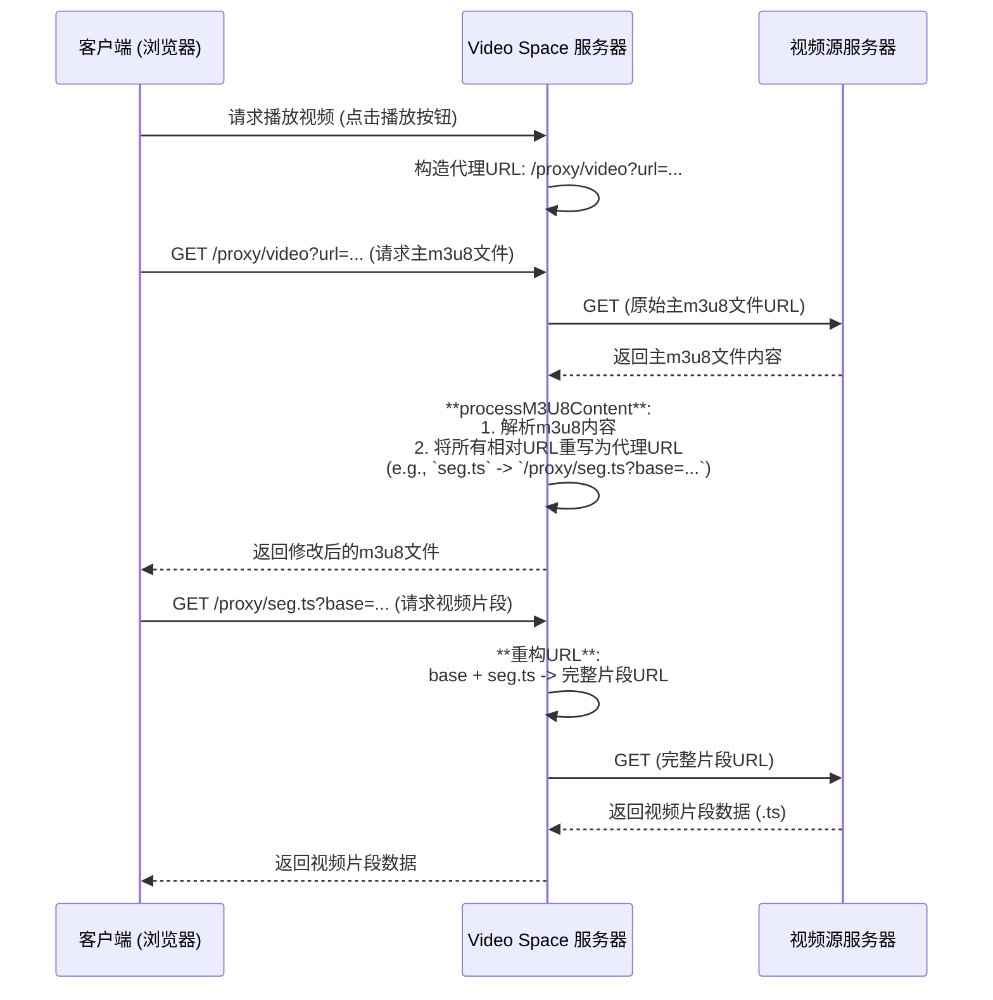

# Video Space - 视频空间

一个现代化的个人视频播放管理应用，旨在提供流畅、无缝的跨域视频观看体验。无论是追剧、看电影还是收藏在线视频，Video Space 都能满足你的需求。

## ✨ 核心亮点

-   **🚀 通用代理引擎**:
    -   **动态 `m3u8` 重写**: 服务器端实时解析 HLS 清单文件 (`.m3u8`)，自动将所有相对路径的视频片段 (`.ts`) 和子清单转换为通过本应用代理的绝对路径，从根本上解决复杂的跨域和防盗链问题。
    -   **智能路由**: 区分主清单文件和媒体片段，使用不同的路由和缓存策略进行处理，确保最佳性能和兼容性。
-   **🎬 多格式播放器**:
    -   **HLS.js**: 为 `.m3u8` 流媒体提供专业、高效的播放支持。
    -   **Video.js**: 作为备选方案，兼容各类视频格式。
    -   **原生支持**: 在 Safari 等浏览器上自动切换到原生 HLS 播放，以获得最佳性能。
-   **💾 本地化存储**:
    -   所有播放列表和观看进度都安全地保存在您的浏览器本地 `localStorage` 中，无需注册或登录。
    -   每部视频卡片自动显示最近一次观看的剧集及其播放进度，随时续看。
-   **📸 实用工具**:
    -   一键截图、保存播放进度、复制视频链接。
-   **📱 响应式设计**:
    -   使用 Tailwind CSS 构建，完美适配桌面、平板和手机。

## 🚀 快速开始

### 1. 安装依赖

```bash
npm install
```

### 2. 启动服务器

```bash
# 生产环境
npm start

# 开发环境 (使用 nodemon 自动重启)
npm run dev
```

### 3. 访问应用

打开浏览器访问: `http://localhost:3000`

## 🛠️ 使用说明

### 添加视频

1.  点击页面右上角的 **“添加视频”** 按钮。
2.  在文本框中，按照以下格式粘贴视频信息：

    ```
    视频系列名称
    <b>第01集</b>https://domain.com/path/to/video1.m3u8
    <b>第02集</b>https://domain.com/path/to/video2.mp4
    ...
    ```

3.  点击 **“解析地址”**。系统会自动验证链接并在列表中创建视频卡片。

## 🔧 代理架构解析

为了解决跨域视频播放的难题，Video Space 采用了一套精巧的服务器端代理架构。

### 请求流程

下面的图表演示了当您播放一个 HLS (`.m3u8`) 视频时，系统的内部工作流程：



### API 接口

#### 通用代理端点

-   `GET /proxy/*`

这是新的核心代理端点，负责处理 HLS 视频流中的 **子清单** 和 **媒体片段** (`.ts` 文件)。它通过 `base` 查询参数来智能地重构原始视频片段的完整 URL。

-   **示例**: 一个被重写后的片段 URL 可能如下所示：
    `/proxy/001.ts?base=https%3A%2F%2Fexample.com%2Fvideos%2F`

#### 传统视频代理端点

-   `GET /proxy/video?url=<视频URL>`

此端点用于发起初始视频请求，特别是获取 `.m3u8` 主清单文件或单个视频文件（如 `.mp4`）。它会将 `.m3u8` 内容传递给服务器进行处理。

#### 视频链接检查

-   `POST /check-video`
-   **请求体**: `{ "url": "..." }`
-   在添加视频时，前端调用此接口以确认视频 URL 是否可以访问。

## 💻 技术栈

-   **后端**: Node.js, Express, Axios
-   **前端**: HTML5, Tailwind CSS, JavaScript
-   **播放器**: HLS.js, Video.js
-   **图标**: Font Awesome

## 📄 许可证

MIT License