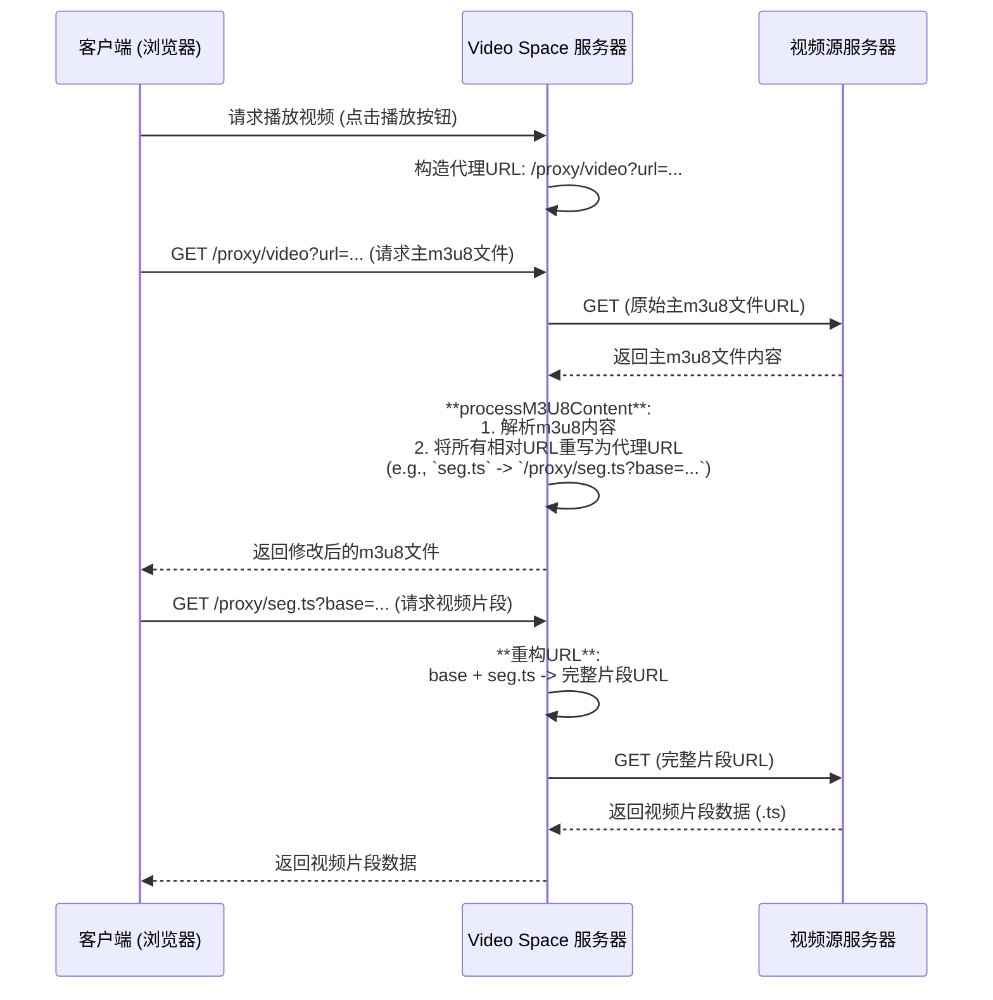

# Video Space - 视频空间

一个现代化的个人视频播放管理应用，旨在提供流畅、无缝的跨域视频观看体验。无论是追剧、看电影还是收藏在线视频，Video Space 都能满足你的需求。

## ✨ 核心亮点

-   **🚀 通用代理引擎**:
    -   **动态 `m3u8` 重写**: 服务器端实时解析 HLS 清单文件 (`.m3u8`)，自动将所有相对路径的视频片段 (`.ts`) 和子清单转换为通过本应用代理的绝对路径，从根本上解决复杂的跨域和防盗链问题。
    -   **智能路由**: 区分主清单文件和媒体片段，使用不同的路由和缓存策略进行处理，确保最佳性能和兼容性。
-   **🎬 多格式播放器**:
    -   **HLS.js**: 为 `.m3u8` 流媒体提供专业、高效的播放支持。
    -   **Video.js**: 作为备选方案，兼容各类视频格式。
    -   **原生支持**: 在 Safari 等浏览器上自动切换到原生 HLS 播放，以获得最佳性能。
-   **💾 本地化存储**:
    -   所有播放列表和观看进度都安全地保存在您的浏览器本地 `localStorage` 中，无需注册或登录。
    -   每部视频卡片自动显示最近一次观看的剧集及其播放进度，随时续看。
-   **📸 实用工具**:
    -   一键截图、保存播放进度、复制视频链接。
-   **📱 响应式设计**:
    -   使用 Tailwind CSS 构建，完美适配桌面、平板和手机。

## 🚀 快速开始

### 1. 安装依赖

```bash
npm install
```

### 2. 启动服务器

```bash
# 生产环境
npm start

# 开发环境 (使用 nodemon 自动重启)
npm run dev
```

### 3. 访问应用

打开浏览器访问: `http://localhost:3000`

## 🛠️ 使用说明

### 添加视频

1.  点击页面右上角的 **“添加视频”** 按钮。
2.  在文本框中，按照以下格式粘贴视频信息：

    ```
    视频系列名称
    <b>第01集</b>https://domain.com/path/to/video1.m3u8
    <b>第02集</b>https://domain.com/path/to/video2.mp4
    ...
    ```

3.  点击 **“解析地址”**。系统会自动验证链接并在列表中创建视频卡片。

## 🔧 代理架构解析

为了解决跨域视频播放的难题，Video Space 采用了一套精巧的服务器端代理架构。

### 请求流程

下面的图表演示了当您播放一个 HLS (`.m3u8`) 视频时，系统的内部工作流程：



### API 接口

#### 通用代理端点

-   `GET /proxy/*`

这是新的核心代理端点，负责处理 HLS 视频流中的 **子清单** 和 **媒体片段** (`.ts` 文件)。它通过 `base` 查询参数来智能地重构原始视频片段的完整 URL。

-   **示例**: 一个被重写后的片段 URL 可能如下所示：
    `/proxy/001.ts?base=https%3A%2F%2Fexample.com%2Fvideos%2F`

#### 传统视频代理端点

-   `GET /proxy/video?url=<视频URL>`

此端点用于发起初始视频请求，特别是获取 `.m3u8` 主清单文件或单个视频文件（如 `.mp4`）。它会将 `.m3u8` 内容传递给服务器进行处理。

#### 视频链接检查

-   `POST /check-video`
-   **请求体**: `{ "url": "..." }`
-   在添加视频时，前端调用此接口以确认视频 URL 是否可以访问。

## 💻 技术架构详解

### 系统架构

Video Space 是一个**跨域视频播放代理应用**，采用前后端分离的单体架构设计，通过服务器端代理技术解决复杂的跨域视频播放问题。

```
┌─────────────────┐    ┌─────────────────┐    ┌─────────────────┐
│   客户端浏览器   │    │   Video Space   │    │   视频源服务器   │
│                 │    │     服务器      │    │                 │
│  ┌───────────┐  │    │  ┌───────────┐  │    │  ┌───────────┐  │
│  │   前端    │  │◄──►│  │   代理    │  │◄──►│  │   视频    │  │
│  │   界面    │  │    │  │   引擎    │  │    │  │   文件    │  │
│  └───────────┘  │    │  └───────────┘  │    │  └───────────┘  │
│  ┌───────────┐  │    │  ┌───────────┐  │    │                 │
│  │ 本地存储  │  │    │  │   静态    │  │    │                 │
│  │(localStorage)│ │    │  │   文件    │  │    │                 │
│  └───────────┘  │    │  └───────────┘  │    │                 │
└─────────────────┘    └─────────────────┘    └─────────────────┘
```

### 核心技术实现

#### 1. 双路由代理系统 (server.js:25-99)

**通用代理端点** `/proxy/*`
- **功能**: 处理HLS片段(.ts文件)和子清单文件
- **URL重构**: 通过`base`参数智能重构完整URL路径
- **错误处理**: 完善的URL验证和错误恢复机制

```javascript
// 示例: 被重写后的片段URL
/proxy/001.ts?base=https%3A%2F%2Fexample.com%2Fvideos%2F
```

**传统视频代理端点** `/proxy/video`
- **功能**: 处理主m3u8文件和普通视频文件
- **向后兼容**: 保持与传统API的兼容性

#### 2. 动态M3U8重写引擎 (server.js:102-202)

**核心函数**: `processM3U8Content(content, baseUrl, req)`

**处理流程**:
1. **解析基础URL**: 提取m3u8文件的基础路径
2. **逐行分析**: 识别并处理相对路径和绝对路径
3. **URL重写**: 将原始URL转换为代理URL
4. **分类处理**: 
   - `.m3u8`文件 → 使用 `/proxy/video` 端点
   - `.ts`片段 → 使用 `/proxy/*` 端点，附带base参数

**智能重写规则**:
```javascript
// 相对URL转换
"segment.ts" → "http://localhost:3000/proxy/segment.ts?base=https://cdn.example.com/videos/"

// 绝对URL代理
"https://cdn.example.com/videos/segment.ts" → "http://localhost:3000/proxy/segment.ts?base=https://cdn.example.com/videos/"
```

#### 3. 流式传输处理 (server.js:330-476)

**HLS流处理**:
- **实时内容修改**: 流式接收m3u8内容并动态修改
- **内存缓冲**: 分块接收和处理，避免大文件内存溢出
- **错误恢复**: 处理中断和错误情况

**TS片段处理**:
- **缓冲传输**: 收集完整TS片段后一次性发送
- **大小统计**: 实时监控传输进度
- **连接管理**: 处理客户端断开连接的情况

#### 4. 请求头模拟系统 (server.js:223-258)

**完整的浏览器模拟**:
```javascript
const headers = {
    'User-Agent': 'Mozilla/5.0 (Windows NT 10.0; Win64; x64) AppleWebKit/537.36...',
    'Accept': 'application/vnd.apple.mpegurl, application/x-mpegurl, */*',
    'Accept-Encoding': 'identity, gzip, deflate, br',
    'Accept-Language': 'zh-CN,zh;q=0.9,en;q=0.8',
    'Connection': 'keep-alive',
    'Referer': 'https://original-site.com/',
    'Origin': 'https://original-site.com'
};
```

**智能Accept头**:
- **HLS流**: `application/vnd.apple.mpegurl, application/x-mpegurl`
- **TS片段**: `video/mp2t, video/MP2T`
- **普通视频**: `video/mp4, video/webm, video/ogg`

#### 5. 前端架构 (video_space.html:275-600)

**状态管理系统**:
```javascript
// 全局状态
let currentVideo = null;
let currentEpisode = null;
let videoPlayer = null;      // Video.js 实例
let hlsInstance = null;      // HLS.js 实例
let isPlayerActive = false;  // 播放器激活状态
```

**本地存储系统**:
- **视频列表**: `localStorage.getItem('videoPlaylists')`
- **观看进度**: 按视频ID和剧集ID存储
- **自动保存**: 播放时自动更新进度

**多播放器支持**:
- **HLS.js**: 专业的HLS流媒体播放器
- **Video.js**: 通用视频播放器，支持多种格式
- **原生播放**: Safari等浏览器的原生HLS支持
- **自动切换**: 根据浏览器兼容性自动选择播放器

#### 6. 用户体验优化

**智能验证系统** (video_space.html:377-428):
- **批量检查**: 并发验证所有视频链接的可访问性
- **Content-Type验证**: 检查返回的内容类型是否支持播放
- **错误统计**: 统计成功和失败的数量，提供详细反馈

**响应式设计**:
- **Tailwind CSS**: 现代化的样式框架
- **移动端适配**: 完美支持手机、平板、桌面设备
- **交互动画**: 平滑的过渡效果和hover状态

**实用工具**:
- **截图功能**: 基于canvas的视频截图
- **进度管理**: 自动保存和恢复观看进度
- **链接复制**: 一键复制视频链接

### 关键技术亮点

#### 1. 透明代理技术
- **无缝重写**: 用户无需感知URL重写过程
- **保持兼容**: 保持原始视频的所有功能和特性
- **性能优化**: 智能缓存和流式传输

#### 2. 错误恢复机制
- **多层错误处理**: 从网络请求到内容处理的完整错误处理
- **降级策略**: 当一种播放器失败时自动切换到备选方案
- **用户友好**: 详细的错误信息和解决建议

#### 3. 安全性考虑
- **输入验证**: 严格的URL格式验证
- **内容类型检查**: 防止恶意内容传播
- **请求限制**: 适当的超时和重试机制

#### 4. 性能优化
- **流式处理**: 避免大文件的内存占用
- **并发处理**: 批量验证和并发请求
- **缓存策略**: 合理的缓存控制设置

### 应用场景

1. **追剧管理**: 收藏和管理多集连续剧
2. **跨域播放**: 解决视频网站的跨域限制
3. **进度跟踪**: 自动记录观看进度，支持续看
4. **视频收藏**: 建立个人视频库，方便管理
5. **截图分享**: 捕获精彩瞬间并分享给朋友

这个项目本质上是一个**个人视频播放网关**，通过巧妙的技术设计，将复杂的跨域问题透明化处理，为用户提供了简洁、高效的视频观看体验。

## 💻 技术栈

-   **后端**: Node.js, Express, Axios
-   **前端**: HTML5, Tailwind CSS, JavaScript
-   **播放器**: HLS.js, Video.js
-   **图标**: Font Awesome

## 📄 许可证

MIT License